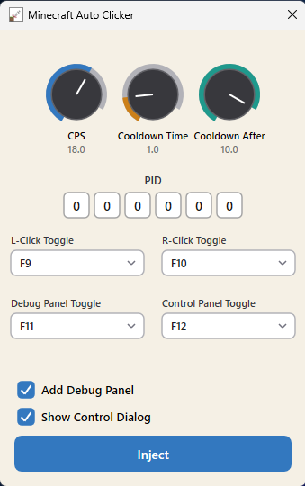
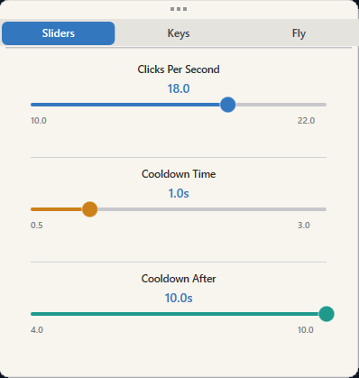

<div align="center">
  
  <h1>Minecraft Auto Clicker</h1>
  <p>DLL injector + auto-clicker I built from bare APIs while learning Win32 and Direct2D.<br/>Injects into a running Minecraft process and handles clicking with enough jitter to feel human.</p>
</div>

---



## What it does

Inject the DLL, and a few background threads kick off handling everything:

- **Auto-clicking** — left or right click at a set CPS, with jittered delays and occasional micro-bursts so the pattern doesn't look robotic
- **Control panel** — a floating in-game panel rendered with Direct2D where you can tune CPS, cooldowns, and keybinds without re-injecting
- **Debug overlay** — a translucent HUD showing live CPS, average CPS, and expected CPS at a glance

Settings persist to a binary file in `%AppData%\AcApp` (fallback : `%TEMP%`) so you don't have to reconfigure every session.

---

## Control Panel



The control panel is fully custom-drawn using Direct2D — sliders, rotary knobs, dropdowns, checkboxes, the works. All widgets are remappable.

| Setting | Range / Options |
|---|---|
| CPS | 10 – 22 |
| Click mode | Left / Right (mutually exclusive toggle) |
| Humanization | Jitter, micro-bursts, drift simulation (fixed)|
| Trigger cooldown | Configurable |
| Cooldown period | Configurable |
| Keybinds | F1–F12 + Middle Mouse, remappable in-app |

---

## Debug Overlay


Small translucent HUD that shows current CPS vs avg CPS vs expected CPS, useful during testing, to see if the humanization is doing its job and to help configuring.

---

## Project structure

Everything's flat in the solution root — intentional, so VS filter organization handles the actual grouping. Open the `.sln` and it'll make sense.

```
Addon.dll         ← injected payload (auto-clicker logic + UI)
main.cpp          ← injector host (Win32 window, DLL injection)
Graphics.cpp/h    ← thin Direct2D wrapper
Renderer.cpp/h    ← main window rendering + widget layout
ControlPanel.*    ← floating in-game control panel
Slider.*          ← custom slider widget
Knob.*            ← rotary knob widget
Button.*          ← button widget (normal + bottom-padded variants)
Checkbox.*        ← checkbox widget
CustomDropdown.*  ← scrollable dropdown
KeySelector.*     ← paired F-key picker
PidInput.*        ← digit-box PID entry widget
Config.hpp        ← flat binary config r/w to %TEMP%
```

---

## Building

Needs **Visual Studio** with the Windows SDK. Direct2D and DWrite headers come with the default Desktop C++ workload so nothing extra to install.  
**NOTE : It is recommended to compile the app and dll yourself to match your machine rather than downloading one from releases (x64 version)**
```
1. Clone the repo
2. Open the .sln in Visual Studio
3. Build Release | x64 (both projects, injector & dll)
```

---

## Usage

```
1. Start Minecraft
2. Grab the Minecraft PID from Task Manager
3. Launch the injector, type the PID into the digit boxes
4. Set your CPS, cooldowns, and keybinds
5. Hit Inject
6. In-game, press your toggle key to start/stop clicking
```

Control panel and debug overlay toggle independently — defaults are `F11` / `F12`.

---

## Disclaimer

Side project I made to get used to Win32, Direct2D, espacially DLL injection, and thread. (may recieve tweaks and more hacks in future), not meant to be used in competitive play.  
  
- No responsibility taken for bans or account issues
- Anti-cheat (EAC, VAC, etc.) can detect injection regardless of click patterns
- Use it on your own accounts where it's actually allowed
- Or maybe troll your friends in **your own server**

*Built to learn, not to ruin anyone's game.*
