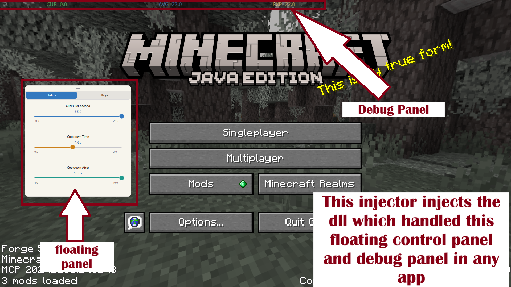
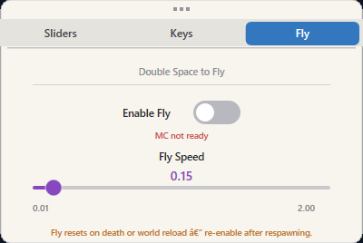

<div align="center">
  
  <h1>Minecraft Auto Clicker</h1>
  <p>DLL injector + auto-clicker I built basically from scratch while learning Win32 and Direct2D.<br/>Injects into a running Minecraft process and handles clicking with enough jitter to not look sus.</p>
</div>

The injection and overlay system is pretty generic honestly, same approach would work for attaching to other processes, games, desktop apps, whatever has a window. Minecraft is just what I tested against but the DLL injection, Direct2D overlay and thread stuff carries over to pretty much anything you want to hook into.


## What it actually does

Inject the DLL and a few background threads start up handling everything:
- **Auto-clicking** left or right click at a set CPS (clicks per second), with jittered delays and occasional micro-bursts so the pattern doesnt look robotic
- **Fly hack** toggle creative-style flight in survival with adjustable speed, controled from a separate panel tab
- **Control panel** floating in-game panel rendered with Direct2D where you can tune CPS, cooldowns, keybinds, fly settings without having to re-inject every time
- **Debug overlay** translucent HUD showing live CPS, average CPS, expected CPS at a glance

Settings get saved to a binary file in `%AppData%\AcApp` (falls back to `%TEMP%` if that fails) so you dont have to reconfigure every single session.



> Note: panel shown above is an older version, Fly tab wasnt added yet at that point.

## Control Panel


Whole control panel is custom drawn using Direct2D, sliders, rotary knobs, dropdowns, checkboxes, all of it. Everything is remappable. Panel has three tabs: **Sliders**, **Keys**, and **Fly**.

| Setting | Range / Options |
|---|---|
| CPS | 10 – 22 |
| Click mode | Left / Right (mutually exclusive toggle) |
| Humanization | Jitter, micro-bursts, drift simulation |
| Trigger cooldown | Configurable |
| Cooldown period | Configurable |
| Keybinds | F1–F12 + Middle Mouse, remappable in-app |

## Fly Hack



Accessible from the Fly tab. Enables creative-style flight in survival using JVM reflection under the hood, no mods needed, just the injected DLL talking directly to the running JVM.

| Setting | Range / Notes |
|---|---|
| Enable Fly | Toggle on/off |
| Fly Speed | 0.01 – 2.0 (default Minecraft value is around 0.05) |

Once enabled just double-tap Space in-game to take off, same as regular creative flight.

> ⚠️ Fly state resets on death and world reload. Just re-toggle it from the panel after respawning or re-entering a world. The toggle accuratly reflects the current in-game state when you switch to the Fly tab so you can tell whats actually on.

## Debug Overlay


Small translucent HUD showing current CPS vs avg CPS vs expected CPS. Useful during testing to see if the humanization is actually doing anything and helps with configuring the settings.

## Project structure

Everything is under `src/` and `include/`, open the `.sln` and the VS filter grouping handles the rest.

```
Addon.dll         ← injected payload (auto-clicker + fly hack logic + UI)
main.cpp          ← injector host (Win32 window, DLL injection)
mclib.h           ← thin C API over JVM reflection (fly, XP, item count)
Graphics.cpp/h    ← thin Direct2D wrapper
Renderer.cpp/h    ← main window rendering + widget layout
ControlPanel.*    ← floating in-game control panel (Sliders / Keys / Fly tabs)
Slider.*          ← custom slider widget
Knob.*            ← rotary knob widget
Button.*          ← button widget (normal + bottom-padded variants)
Checkbox.*        ← checkbox widget
CustomDropdown.*  ← scrollable dropdown
KeySelector.*     ← paired F-key picker
PidInput.*        ← digit-box PID entry widget
Config.hpp        ← flat binary config r/w to %AppData%\AcApp
```

## Building

Needs Visual Studio with the Windows SDK. Direct2D and DWrite headers come with the default Desktop C++ workload so nothing extra to install.

NOTE: Its recomended to compile both the app and dll yourself to match your machine rather than downloading from releases (x64 version)

```
1. Clone the repo
2. Open the .sln in Visual Studio
3. Build Release | x64 (both projects, injector and dll)
```

## Usage

```
1. Start Minecraft
2. Grab the Minecraft PID from Task Manager
3. Launch the injector, type the PID into the digit boxes
4. Set your CPS, cooldowns, and keybinds
5. Hit Inject
6. In-game, press your toggle key to start/stop clicking
7. Open the Fly tab in the control panel to enable flight
```

Control panel and debug overlay toggle independently, defaults are F11 / F12.

## Disclaimer

Side project I made to learn Win32, Direct2D, DLL injection and threading. Might add more stuff to it later but no promises. Not meant for competitive play.

- No responsibility taken for bans or account issues
- Anti-cheat (EAC, VAC, etc.) might detect injection regardless of click patterns
- Use it on your own accounts where its actually allowed
- Or to troll your friends on your own server I guess

*Dont use this to ruin anyone elses game*